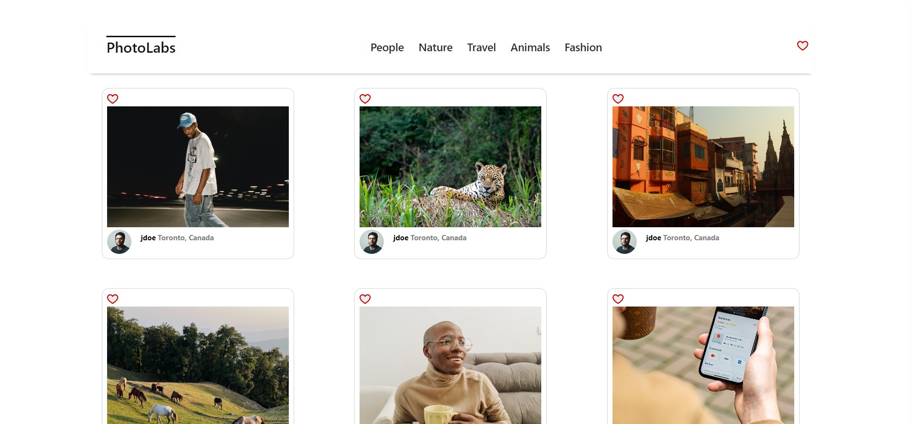
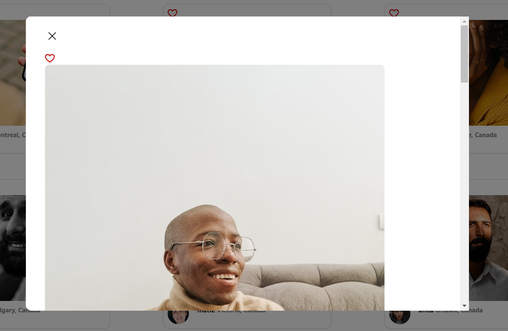
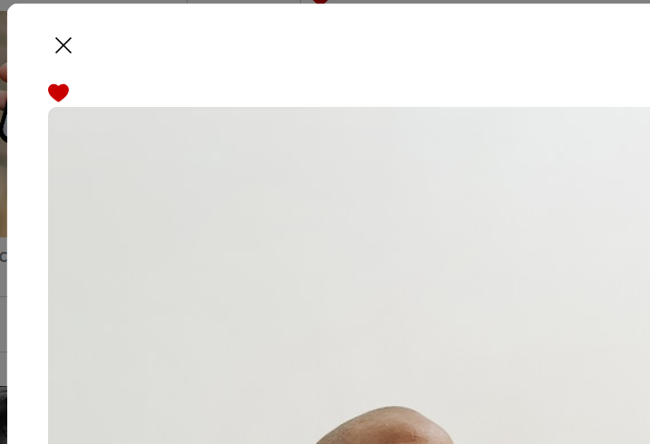

# react-photolabs
The PhotoLabs project for the Web Development React course programming. PhotoLabs is a dynamic web application that empowers users to explore and engage with photos in various contexts. Key features include:

Photo Viewing: Users can seamlessly browse through a collection of captivating photos. Whether it’s stunning landscapes, adorable animals, or striking portraits, PhotoLabs offers an immersive viewing experience.
Favorites Selection: Users can click to mark their favorite photos. 
Comprehensive Gallery: A collection of multiples of galleries into one place.
Photo Modal: When users click on a specific photo, a separate modal window opens up. This modal provides additional details about the photo, including user-generated content and related images.
In summary, PhotoLabs combines aesthetics, functionality, and user interaction to create an engaging platform for photo enthusiasts.

# Photolabs

## Setup

Install dependencies with `npm install` in each respective `/frontend` and `/backend`.

## [Frontend] Running Webpack Development Server

```sh
cd frontend
npm start
```

## [Backend] Running Backend Servier

Read `backend/readme` for further setup details.

```sh
cd backend
npm start
```
## Dependencies

- Express
- Node
- nodemon
- cors
- helmet
- body-parser
- pg

## Screenshots



